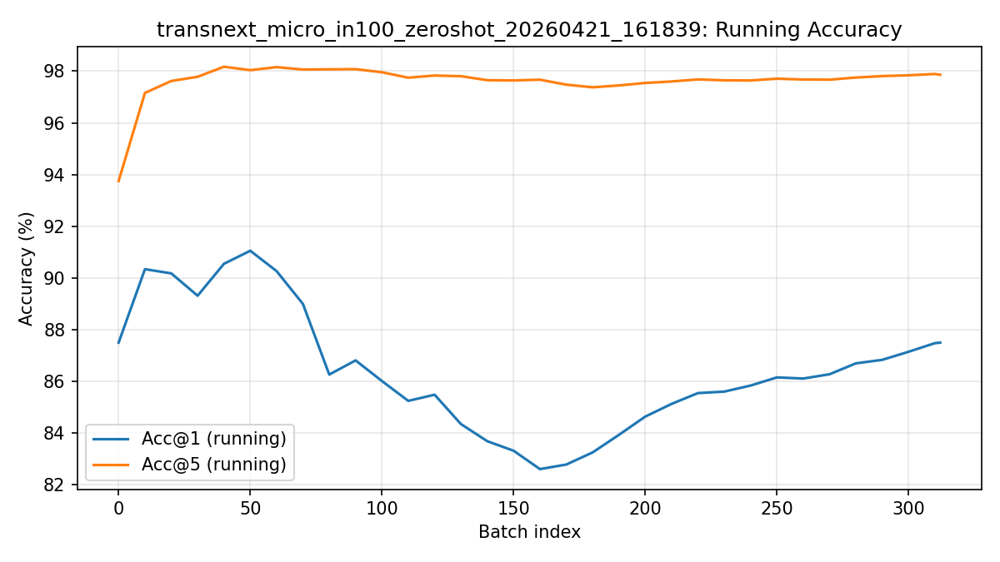
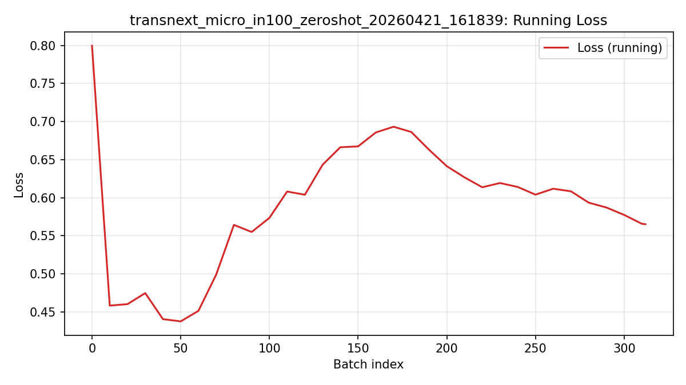
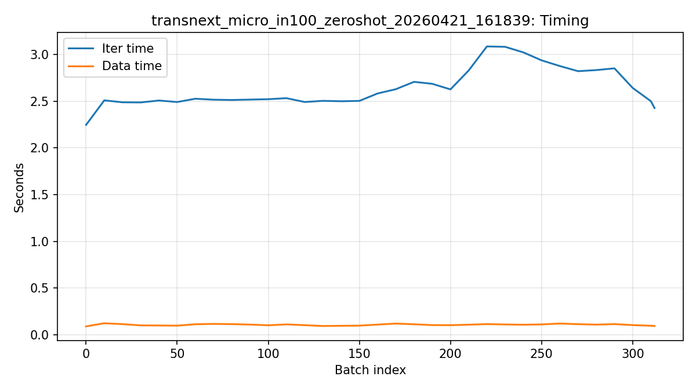

# TransNeXt Evaluation Report

Generated: 2026-04-21 17:24:55

## Scope
This report summarizes zero-shot evaluation logs for TransNeXt runs.

## Summary Table

| Run | Completed | Model | Device | Final Acc@1 | Final Acc@5 | Final Loss | Last Running Acc@1 | Log |
|---|---:|---|---|---:|---:|---:|---:|---|
| transnext_micro_in100_zeroshot_20260421_161839 | True | transnext_micro | cpu | 87.500 | 97.860 | 0.565 | 87.500 | runs/transnext_micro_in100_zeroshot_20260421_161839.log |

## Files

- Summary CSV: summary.csv
- Per-run progress CSV folder: csv

## Per-Run Details

### transnext_micro_in100_zeroshot_20260421_161839

- Log file: ../transnext_micro_in100_zeroshot_20260421_161839.log
- Model: transnext_micro
- Device: cpu
- Data path: data/imagenet-100
- Checkpoint: models/transnext_micro_224_1k.pth
- Batch size / eval batch size: 16 / 16
- Num workers: 0
- Completed: True
- Progress: batch 312 / 313
- Final metrics: Acc@1=87.500, Acc@5=97.860, Loss=0.565
- Mean iter/data time (sampled): 2.6378s / 0.1054s

## Notes
- If a run is partial, use last running metrics only as progress indicators.
- For reproducibility claims, compare only runs with the same checkpoint, mapping, and eval protocol.
- ImageNet-100 subset results are not directly comparable to full ImageNet-1K paper baselines.
