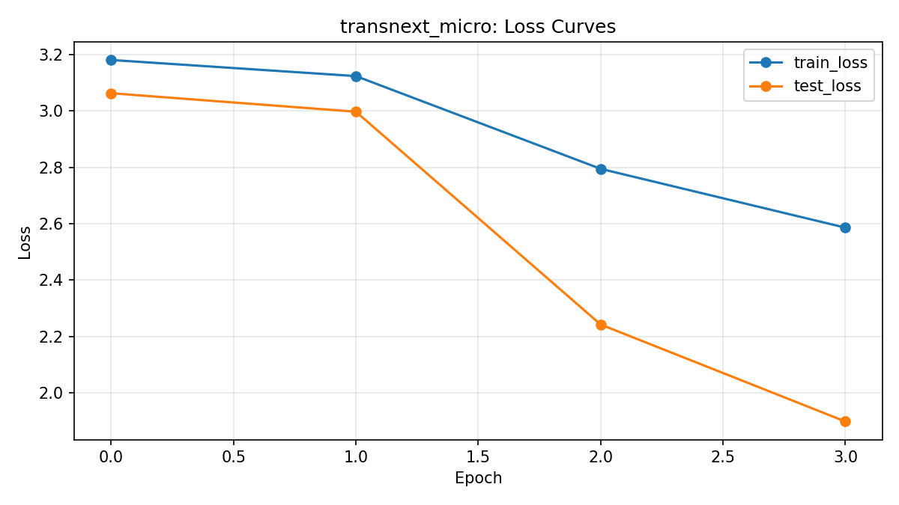
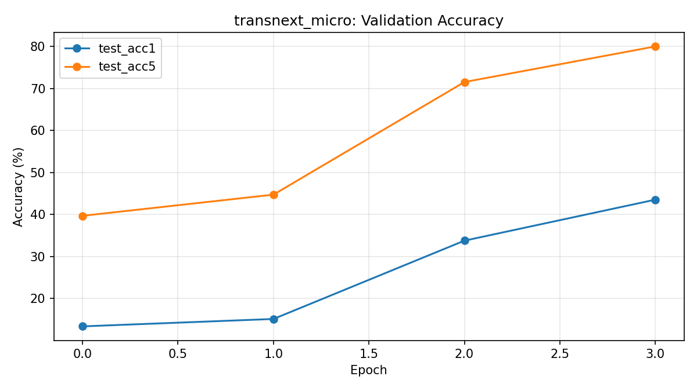
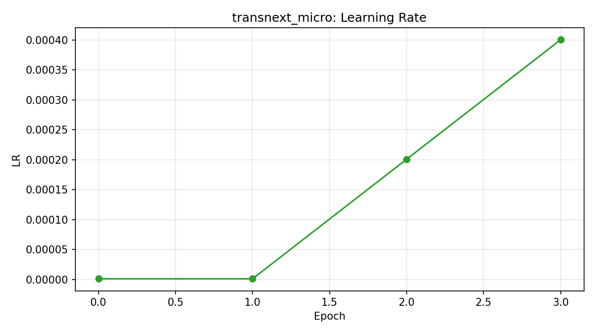

# TransNeXt Training Report

Generated: 2026-04-22 16:10:38

- Source log: checkpoints/transnext_micro/log.txt
- Epoch rows parsed: 4
- CSV: epochs.csv

## Final Epoch Snapshot

- epoch: 3
- train_loss: 2.5855502635974603
- test_loss: 1.897700141977381
- test_acc1: 43.52000008239746
- test_acc5: 79.99999946289063
- train_lr: 0.0004005999999999903
- n_parameters: 12433929
- best_test_acc1: 43.5200

## Plots

